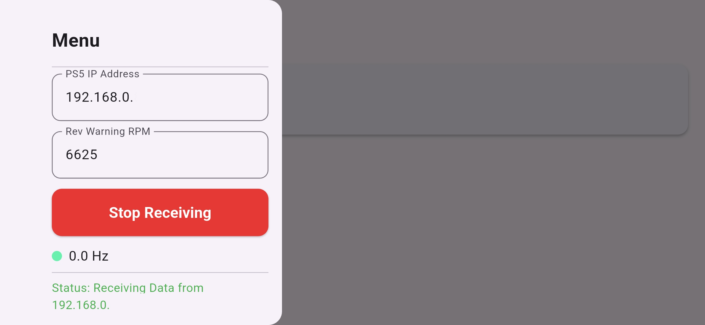
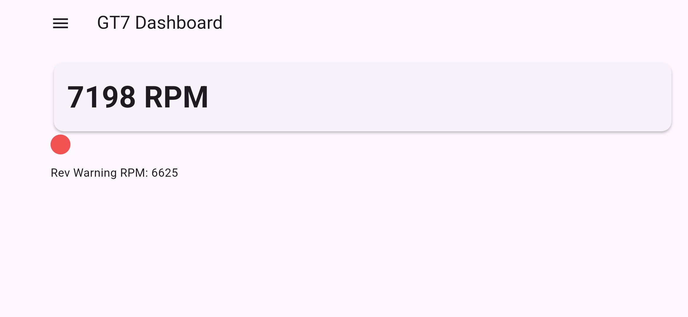
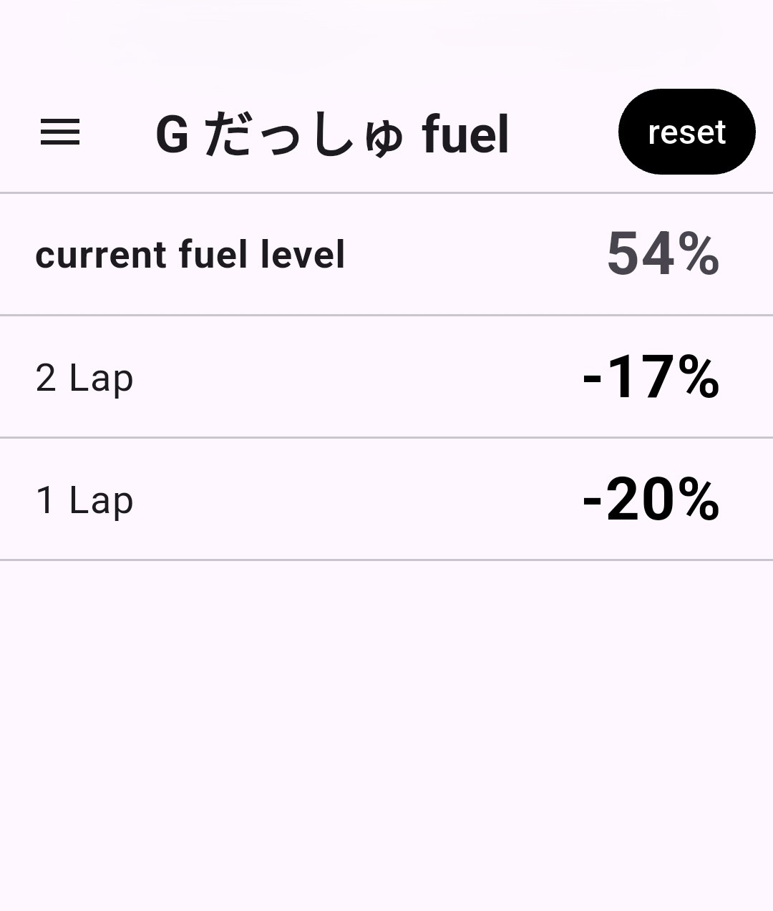
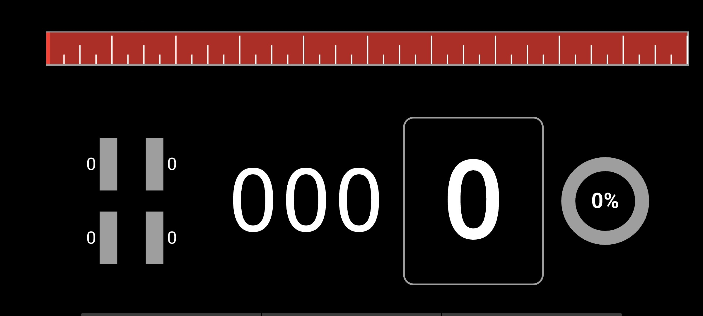
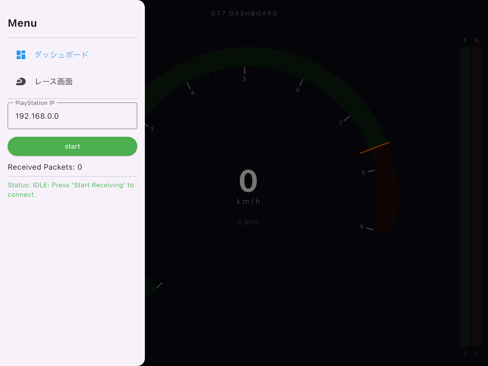
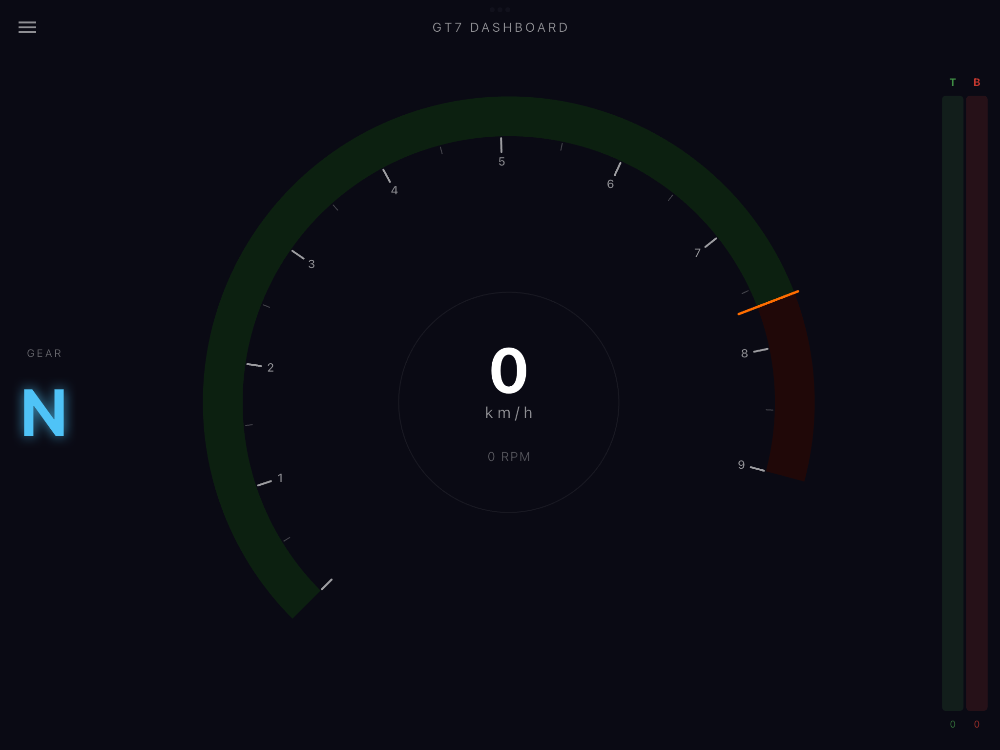
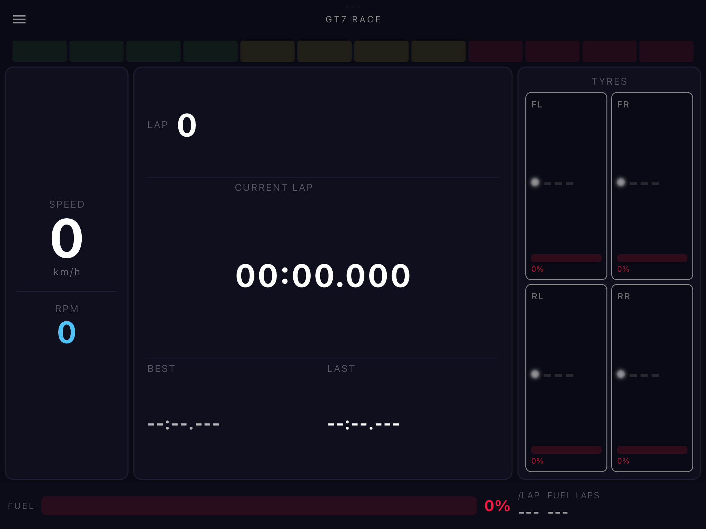

# NSGT7

レーシングゲーム *Gran Turismo 7 (GT7)* が UDP で送信するテレメトリデータを受信し、iOS / Android などのデバイス上にダッシュボードとして表示する Flutter アプリです。  
A Flutter application that receives telemetry data from *Gran Turismo 7 (GT7)* via UDP and displays it as a dashboard on iOS, Android, and other platforms.

パケット仕様書を同梱しているため、vibe coding でカスタムダッシュボードを構築できます。  
A packet specification document is included, enabling custom dashboard development with vibe coding.

  
  

## 拡張例 / Extension Examples

  
  

---

## 🚀 機能 / Features

* **クロスプラットフォーム対応 / Cross-platform Support**  
  Flutter 製のため iOS・Android をはじめ複数のプラットフォームで動作します。  
  Built with Flutter — runs on iOS, Android, and more.

* **IP アドレス設定 / IP Address Configuration**  
  アプリ内から PlayStation の IP アドレスを設定・保存できます。  
  Set and save the PlayStation's IP address directly within the app.

* **接続制御 / Communication Control**  
  ボタン一つで受信の開始・停止ができます。  
  Start and stop data reception with a single button.

* **レブ警告 RPM の編集 / Editable Rev Warning RPM**  
  警告が点灯し始める回転数を自分で編集でき、車両ID（Car ID）に紐づけて保存されるため、車両ごとに異なる設定を保持できます。  
  Edit the RPM at which the warning indicator starts; it's saved keyed by the vehicle's Car ID, so each car keeps its own setting.

* **パケット復号 / Packet Parsing**  
  GT7 独自の Salsa20 暗号化パケットを復号し、正確にデータを抽出します。  
  Decrypts GT7's Salsa20-encrypted packets and extracts data accurately.

* **テレメトリ表示 / Real-time Data Display**  
  パケットから以下の値がデコードされており、Flutter ウィジェットを追加するだけで表示できます。  
  The following values are decoded from every packet and ready to display — adding a new gauge takes only a few lines of Flutter widget code.

  | 値 / Value | 状態 / Status |
  |---|---|
  | RPM（エンジン回転数 / Engine Speed） | ✅ デフォルト表示 / Displayed by default |
  | 車速 / Car Speed | 追加可能 / Ready to display |
  | ギア / Current Gear | 追加可能 / Ready to display |
  | アクセル・ブレーキ / Throttle & Brake | 追加可能 / Ready to display |
  | タイヤ温度・ラップタイム・ブーストなど | `docs/packet_structure.md` 参照 |

---

## 🔧 技術スタック / Technical Stack

| 項目 / Element | 詳細 / Details |
|---|---|
| フレームワーク / Framework | Flutter (Dart) |
| 通信 / Communication | UDP Socket |
| 暗号化 / Encryption | Salsa20 (`pointycastle`) |
| 対応プラットフォーム / Platforms | Android, iOS |

---

## 📐 主なデータオフセット / Key Data Offsets

テレメトリデータのオフセット一覧（GT7 のバージョンアップで変わる可能性があります）。  
Key telemetry offsets used in decoding. May change with GT7 updates.

| データ / Data | オフセット(10進) / Offset (Dec) | 型 / Type |
|---|---|---|
| RPM | 60 | float |
| 車速 / Speed | 76 | float |
| ギア / Gear | 144 | uint8 |
| アクセル / Throttle | 145 | uint8 |
| ブレーキ / Brake | 146 | uint8 |

全フィールドの仕様は [`docs/packet_structure.md`](docs/packet_structure.md) を参照してください。  
For the full field specification, see [`docs/packet_structure.md`](docs/packet_structure.md).

---

## Built with Vibe Coding

  
  
  

